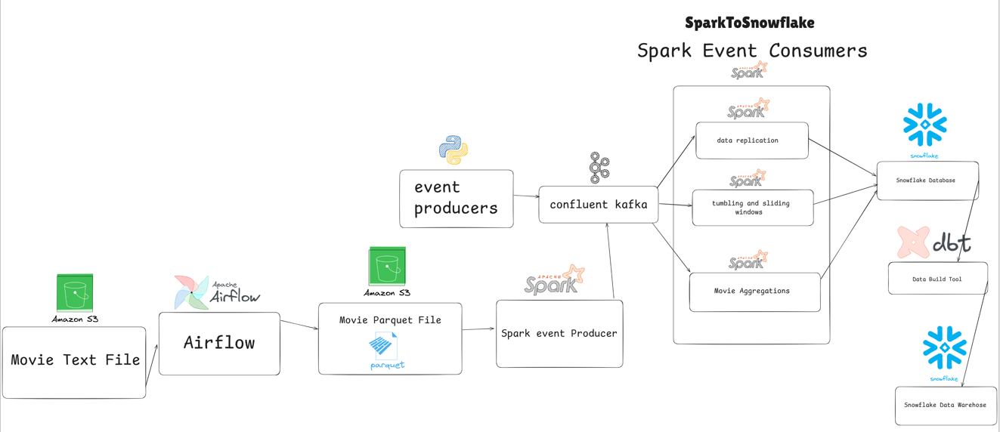

# 📊 Data Engineering with Python and PySpark — Final Project

This project is the final capstone for an internal Data Engineering course. It demonstrates an end-to-end real-time data pipeline built with modern data engineering tools and technologies including **Kafka**, **Avro**, **PySpark**, **Snowflake**, and **Airflow**.

---

## 🧠 Project Summary

**Objective**: Build a real-time data processing pipeline for a **consumer segmentation application**. Simulate user events (like registrations or logins), stream them into Kafka, process them with PySpark Structured Streaming, aggregate insights using sliding windows, and write analytics to Snowflake. Airflow DAGs are used for batch ETL orchestration.

---

## 🛠️ Technologies Used

| Tool          | Purpose                                  |
|---------------|-------------------------------------------|
| **Kafka**     | Real-time data ingestion                 |
| **Avro**      | Message serialization with schema support |
| **Schema Registry** | Central schema management        |
| **PySpark**   | Stream processing & transformation       |
| **Snowflake** | Data warehouse for storing final metrics |
| **Airflow**   | Workflow orchestration for ETL pipelines |

---

## 🔄 Pipeline Overview

### 🔹 Kafka + Avro
- Simulated user events are published to Kafka topics.
- Avro schemas are used to serialize and validate messages.
- Schema Registry ensures versioning and compatibility.

### 🔹 PySpark Structured Streaming
- Consumes Kafka data in real-time.
- Decodes messages using `from_avro()` and the schema registry.
- Applies transformations (e.g. timestamp casting, window aggregations).
- Uses **watermarking** and **sliding windows** to produce hourly metrics.
- Writes results to Snowflake using `foreachBatch`.

### 🔹 Airflow ETL
- Batch pipelines are orchestrated using Airflow DAGs.
- Performs periodic ingestion and transformation tasks.
- Example: Load customer profiles and enrich segmentation metrics.

---

## 📁 Project Structure

```
.
├── kafka_event_producing        # Kafka Avro producer (simulated events)
├── spark_event_consuming        # PySpark streaming jobs
├── Airflow                      # Airflow DAGs for ETL/analytics
├── Configs                      # Configurations for Kafka, Snowflake, Spark
├── README.md                    # Project overview
```

---

## 📊 Metrics Generated
- Hourly user registration counts (sliding window, 15 min slide)
- Timestamped insights for real-time dashboarding

---

## 🚀 How to Run It

1. Start Kafka and Schema Registry.
2. Run Kafka producers to simulate events.
3. Launch Spark streaming consumer.
4. Start Airflow scheduler for DAG execution.
5. Verify Snowflake tables for metrics.

---

## 🙋‍♂️ About This Project
Built as a final capstone for the internal **Data Engineering Training Program**. Demonstrates proficiency in:
- Real-time streaming
- PySpark transformations
- Schema-driven design
- Batch and stream integration
- End-to-end data pipeline delivery

---

Feel free to fork, reuse, and reach out if you'd like to collaborate or improve it further!

